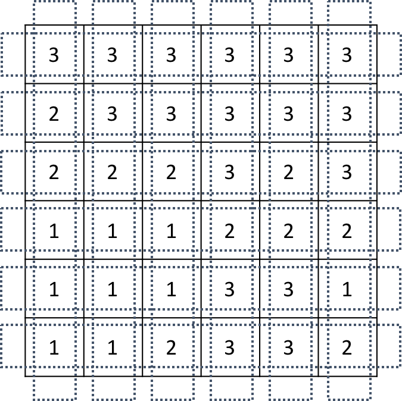
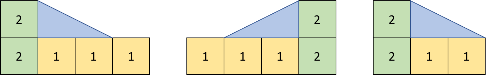
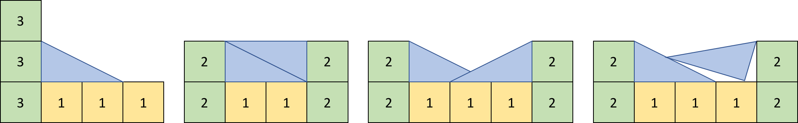
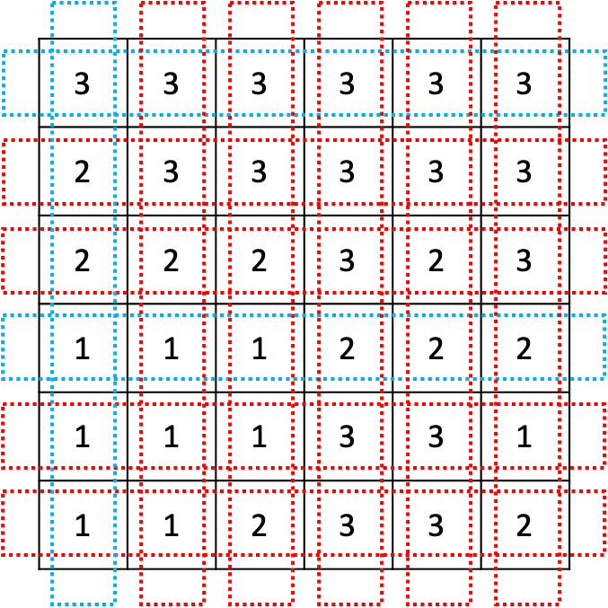
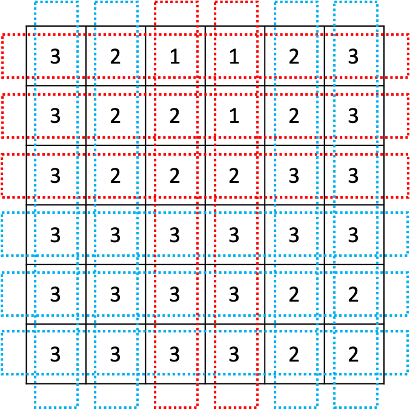
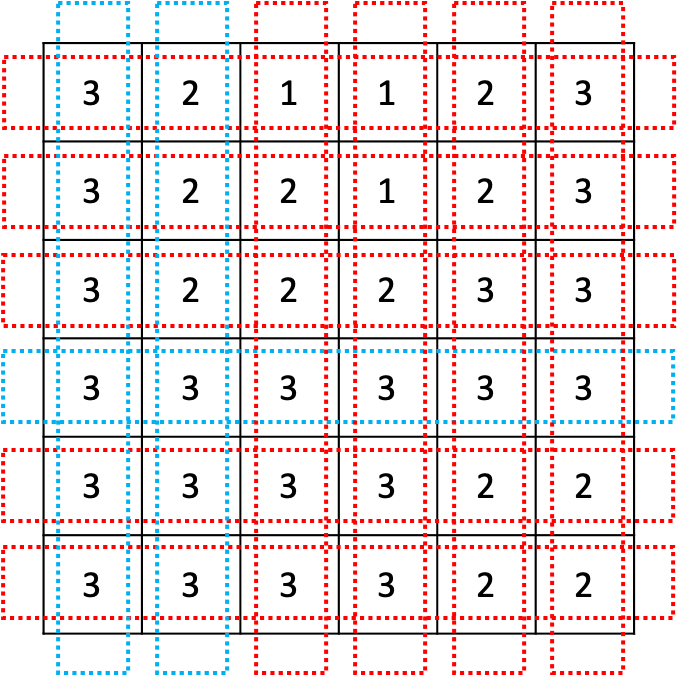
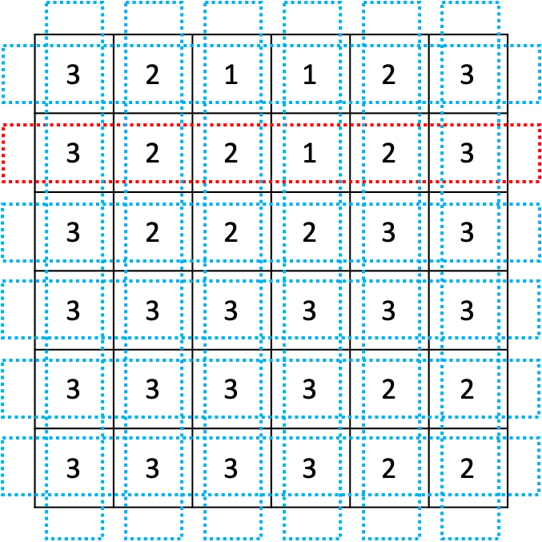

#  14890. 경사로

## 문제

크기가 N×N인 지도가 있다. 지도의 각 칸에는 그 곳의 높이가 적혀져 있다. 

오늘은 이 지도에서 지나갈 수 있는 길이 몇 개 있는지 알아보려고 한다. 길이란 한 행 또는 한 열 전부를 나타내며, 한쪽 끝에서 다른쪽 끝까지 지나가는 것이다. 

다음과 같은 N=6인 경우 지도를 살펴보자.


이때, 길은 총 2N개가 있으며, 아래와 같다.



길을 지나갈 수 있으려면 길에 속한 모든 칸의 높이가 모두 같아야 한다. 또는, 경사로를 놓아서 지나갈 수 있는 길을 만들 수 있다. 경사로는 높이가 항상 1이며, 길이는 L이다. 또, 개수는 매우 많아 부족할 일이 없다. 경사로는 낮은 칸과 높은 칸을 연결하며, 아래와 같은 조건을 만족해야한다.

- 경사로는 낮은 칸에 놓으며, L개의 연속된 칸에 경사로의 바닥이 모두 접해야 한다.
- 낮은 칸과 높은 칸의 높이 차이는 1이어야 한다.
- 경사로를 놓을 낮은 칸의 높이는 모두 같아야 하고, L개의 칸이 연속되어 있어야 한다.

아래와 같은 경우에는 경사로를 놓을 수 없다.

- 경사로를 놓은 곳에 또 경사로를 놓는 경우
- 낮은 칸과 높은 칸의 높이 차이가 1이 아닌 경우
- 낮은 지점의 칸의 높이가 모두 같지 않거나, L개가 연속되지 않은 경우
- 경사로를 놓다가 범위를 벗어나는 경우

L = 2인 경우에 경사로를 놓을 수 있는 경우를 그림으로 나타내면 아래와 같다.



경사로를 놓을 수 없는 경우는 아래와 같다.



위의 그림의 가장 왼쪽부터 1번, 2번, 3번, 4번 예제라고 했을 때, 1번은 높이 차이가 1이 아니라서, 2번은 경사로를 바닥과 접하게 놓지 않아서, 3번은 겹쳐서 놓아서, 4번은 기울이게 놓아서 불가능한 경우이다.

가장 위에 주어진 그림 예의 경우에 지나갈 수 있는 길은 파란색으로, 지나갈 수 없는 길은 빨간색으로 표시되어 있으며, 아래와 같다. 경사로의 길이 L = 2이다.



지도가 주어졌을 때, 지나갈 수 있는 길의 개수를 구하는 프로그램을 작성하시오.


### 입력

첫째 줄에 세로 크기 N과 가로 크기 M이 주어진다. (3 ≤ N, M ≤ 50)

둘째 줄에 로봇 청소기가 있는 칸의 좌표 (r, c)와 바라보는 방향 d가 주어진다. d가 0인 경우에는 북쪽을, 1인 경우에는 동쪽을, 2인 경우에는 남쪽을, 3인 경우에는 서쪽을 바라보고 있는 것이다.

셋째 줄부터 N개의 줄에 장소의 상태가 북쪽부터 남쪽 순서대로, 각 줄은 서쪽부터 동쪽 순서대로 주어진다. 빈 칸은 0, 벽은 1로 주어진다. 지도의 첫 행, 마지막 행, 첫 열, 마지막 열에 있는 모든 칸은 벽이다.

로봇 청소기가 있는 칸의 상태는 항상 빈 칸이다.

### 출력

로봇 청소기가 청소하는 칸의 개수를 출력한다.

### 힌트

예제 2의 경우 아래와 같은 파란색 길을 지나갈 수 있다.



예제 3의 경우에는 아래와 같은 파란색 길이 지나갈 수 있는 길이다.



마지막으로, 예제 4의 경우에는 아래와 같은 파란색 길이 지나갈 수 있는 길이다.




## 예제

### 입력 1

```python
6 2
3 3 3 3 3 3
2 3 3 3 3 3
2 2 2 3 2 3
1 1 1 2 2 2
1 1 1 3 3 1
1 1 2 3 3 2
```

### 출력 1

```python
3
```


### 입력 2

```python
6 2
3 2 1 1 2 3
3 2 2 1 2 3
3 2 2 2 3 3
3 3 3 3 3 3
3 3 3 3 2 2
3 3 3 3 2 2
```

### 출력 2

```python
7
```


### 입력 3

```python
6 3
3 2 1 1 2 3
3 2 2 1 2 3
3 2 2 2 3 3
3 3 3 3 3 3
3 3 3 3 2 2
3 3 3 3 2 2
```

### 출력 3

```python
3
```


### 입력 4

```python
6 1
3 2 1 1 2 3
3 2 2 1 2 3
3 2 2 2 3 3
3 3 3 3 3 3
3 3 3 3 2 2
3 3 3 3 2 2
```

### 출력 4

```python
11
```


## 코드

```python
def is_road(lst, size, slide):
    road = 0
    cnt = 1  # 연속 평지 수
    for i in range(size - 1):
        if abs(lst[i] - lst[i + 1]) >= 2:  # 높이 차이가 큼
            return 0
        elif lst[i] == lst[i + 1]:  # 같은 높이
            cnt += 1
        else:  # 높이 차이가 1
            if lst[i] < lst[i + 1]:  # 올라가기
                if cnt >= slide:  # 경사로 설치 가능
                    cnt = 1
                    continue
                else:  # 불가능
                    return 0
            else:  # 내려가기
                if i + slide >= size:  # 맵 밖
                    return 0
                if sum(lst[i + 1: i + 1 + slide]) // slide == lst[i + 1]:  # 설치 가능
                    cnt = -slide + 1 # 이미 설치
                    continue
                else:  # 공간 부족
                    return 0

    else:
        road += 1
    return road


size, slide = map(int, input().split())  # 맵 크기, 경사로 길이
field = [[] for _ in range(size)]  # 격자 상태
for r in range(size):
    field[r] = list(map(int, input().split()))
ans = 0

# 왼쪽에서 오른쪽으로
for start_row in range(size):
    ans += is_road(field[start_row], size, slide)

# 위에서 아래로
for start_col in range(size):
    temp = []
    for now_row in range(size):
        temp.append(field[now_row][start_col])
    ans += is_road(temp, size, slide)

print(ans)
```
