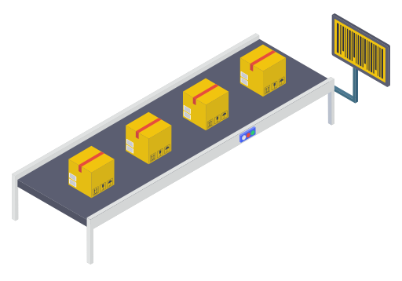
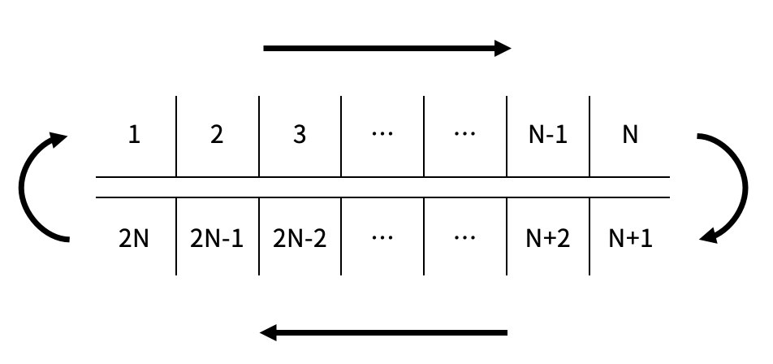

# 20055. 컨베이어 벨트 위의 로봇

## 문제

길이가 N인 컨베이어 벨트가 있고, 길이가 2N인 벨트가 이 컨베이어 벨트를 위아래로 감싸며 돌고 있다. 벨트는 길이 1 간격으로 2N개의 칸으로 나뉘어져 있으며, 각 칸에는 아래 그림과 같이 1부터 2N까지의 번호가 매겨져 있다.





벨트가 한 칸 회전하면 1번부터 2N-1번까지의 칸은 다음 번호의 칸이 있는 위치로 이동하고, 2N번 칸은 1번 칸의 위치로 이동한다. i번 칸의 내구도는 Ai이다. 위의 그림에서 1번 칸이 있는 위치를 "**올리는 위치**", N번 칸이 있는 위치를 "**내리는 위치**"라고 한다.

컨베이어 벨트에 박스 모양 로봇을 하나씩 올리려고 한다. 로봇은 올리는 위치에만 올릴 수 있다. 언제든지 로봇이 내리는 위치에 도달하면 그 즉시 내린다. 로봇은 컨베이어 벨트 위에서 스스로 이동할 수 있다. 로봇을 올리는 위치에 올리거나 로봇이 어떤 칸으로 이동하면 그 칸의 내구도는 즉시 1만큼 감소한다.

컨베이어 벨트를 이용해 로봇들을 건너편으로 옮기려고 한다. 로봇을 옮기는 과정에서는 아래와 같은 일이 순서대로 일어난다.


1. 벨트가 각 칸 위에 있는 로봇과 함께 한 칸 회전한다.
2. 가장 먼저 벨트에 올라간 로봇부터, 벨트가 회전하는 방향으로 한 칸 이동할 수 있다면 이동한다. 만약 이동할 수 없다면 가만히 있는다.
   1. 로봇이 이동하기 위해서는 이동하려는 칸에 로봇이 없으며, 그 칸의 내구도가 1 이상 남아 있어야 한다.
3. 올리는 위치에 있는 칸의 내구도가 0이 아니면 올리는 위치에 로봇을 올린다.
4. 내구도가 0인 칸의 개수가 K개 이상이라면 과정을 종료한다. 그렇지 않다면 1번으로 돌아간다.

종료되었을 때 몇 번째 단계가 진행 중이었는지 구해보자. 가장 처음 수행되는 단계는 1번째 단계이다.

### 입력

첫째 줄에 N, K가 주어진다. 둘째 줄에는 A1, A2, ..., A2N이 주어진다.

### 출력

몇 번째 단계가 진행 중일때 종료되었는지 출력한다.

### 제한

- 2 ≤ N ≤ 100
- 1 ≤ K ≤ 2N
- 1 ≤ Ai ≤ 1,000

## 예제

### 입력 1

```python
3 2
1 2 1 2 1 2
```

### 출력 1

```python
2
```


### 입력 2

```python
3 6
10 10 10 10 10 10
```

### 출력 2

```python
31
```


### 입력 3

```python
4 5
10 1 10 6 3 4 8 2
```

### 출력 3

```python
24
```


### 입력 4

```python
5 8
100 99 60 80 30 20 10 89 99 100
```

### 출력 4

```python
472
```


## 코드

- Pypy3으로 통과, Python3으로는 시간초과

```python
from collections import deque
import sys


length, limit = map(int, sys.stdin.readline().split())  # 컨베이어 벨트 길이, 내구도 0인 칸의 개수 한계
durable_lst = deque(map(int, sys.stdin.readline().split()))  # 컨베이어 벨트 내구도 리스트

start = 0  # 올리는 위치
end = length - 1  # 내리는 위치
robots = deque([0]) * (length * 2)

cnt = 0
while durable_lst.count(0) < limit:
    cnt += 1  # 단계 + 1

    # 1. 벨트 한 칸씩 이동
    durable_lst.appendleft(durable_lst.pop())
    robots.appendleft(robots.pop())

    # 2. 로봇 한 칸씩 이동
    for robot_idx in range(length - 1, 0, -1):
        if robot_idx == end and robots[robot_idx]:  # 로봇이 내리는 위치에 도착
            robots[robot_idx] = 0  # 로봇 내리기
        if robots[robot_idx] and not robots[robot_idx + 1] and durable_lst[robot_idx + 1]:  # 로봇이 있고 다음 칸에 로봇이 없고 내구도가 있으면
            robots[robot_idx] -= 1  # 이동 시작
            robots[robot_idx + 1] += 1  # 이동 끝
            durable_lst[robot_idx + 1] -= 1  # 내구도 감소
        if robot_idx + 1 == end and robots[robot_idx + 1]:  # 로봇이 내리는 위치에 도착
            robots[robot_idx + 1] = 0  # 로봇 내리기

    # 3. 올리는 위치에 로봇 올리기
    if durable_lst[start]:
        robots[start] = 1  # 로봇 올리기
        durable_lst[start] -= 1  # 내구도 감소

print(cnt)
```
