# 21611. 마법사 상어와 블리자드

## 문제

마법사 상어는 [파이어볼](https://www.acmicpc.net/problem/20056), [토네이도](https://www.acmicpc.net/problem/20057), [파이어스톰](https://www.acmicpc.net/problem/20058), [물복사버그](https://www.acmicpc.net/problem/21610), [비바라기](https://www.acmicpc.net/problem/21610) 마법을 할 수 있다. 오늘 새로 배운 마법은 블리자드이고, 크기가 N×N인 격자에서 연습하려고 한다. N은 항상 홀수이고, (r, c)는 격자의 r행 c열을 의미한다. 격자의 가장 왼쪽 윗 칸은 (1, 1)이고, 가장 오른쪽 아랫 칸은 (N, N)이며 마법사 상어는 ((N+1)/2, (N+1)/2)에 있다.

일부 칸과 칸 사이에는 벽이 세워져 있으며, 다음은 N = 3, 5, 7인 경우의 예시이다. 실선은 벽이고, 점선은 벽이 아니다. 칸에 적혀있는 수는 칸의 번호이다.

| 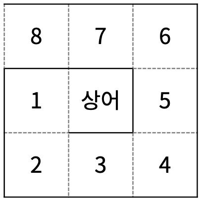 | 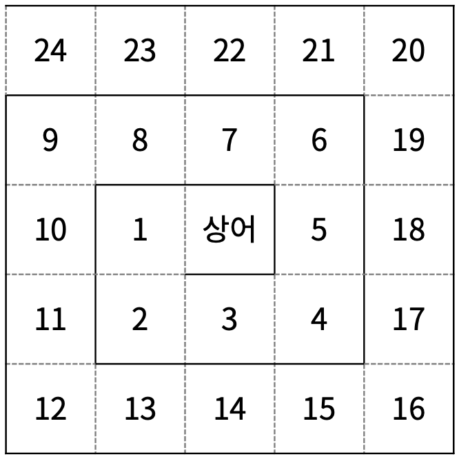 | 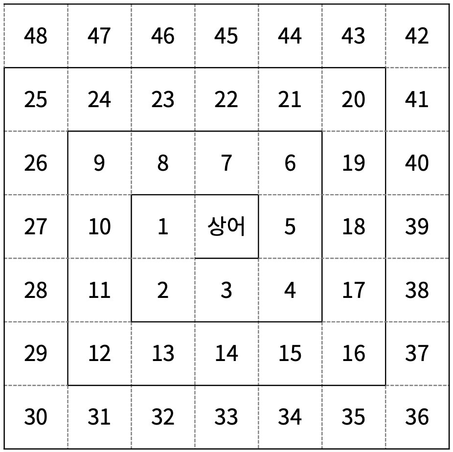 |
| ----------------------------------------------------- | ------------------------------------------------------------ | ------------------------------------------------------------ |
| N = 3                                                 | N = 5                                                        | N = 7                                                        |

가장 처음에 상어가 있는 칸을 제외한 나머지 칸에는 구슬이 하나 들어갈 수 있다. 구슬은 1번 구슬, 2번 구슬, 3번 구슬이 있다. 같은 번호를 가진 구슬이 번호가 연속하는 칸에 있으면, 그 구슬을 연속하는 구슬이라고 한다. 다음은 N = 7인 경우 예시이다. 


블리자드 마법을 시전하려면 방향 di와 거리 si를 정해야 한다. 총 4가지 방향 ↑, ↓, ←, →가 있고, 정수 1, 2, 3, 4로 나타낸다. 상어는 di 방향으로 거리가 si 이하인 모든 칸에 얼음 파편을 던져 그 칸에 있는 구슬을 모두 파괴한다. 구슬이 파괴되면 그 칸은 구슬이 들어있지 않은 빈 칸이 된다. 얼음 파편은 벽의 위로 떨어지기 때문에, 벽은 파괴되지 않는다.

다음 예시는 방향은 아래, 거리는 2인 경우이다.

| 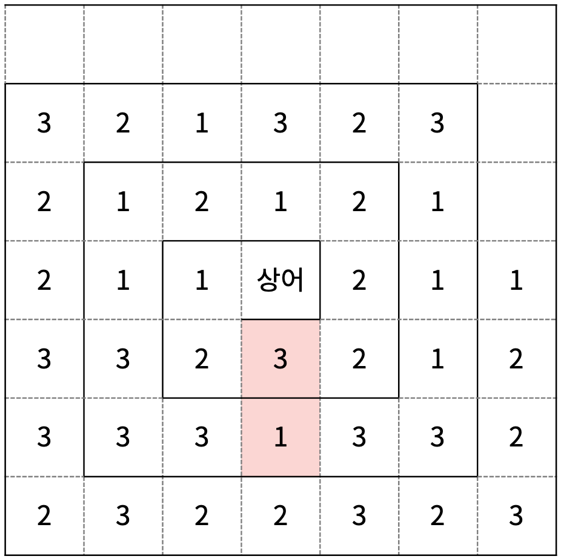 |  |
| ------------------------------------------------------------ | ------------------------------------------------------------ |
| 빨간색으로 표시된 칸에 얼음 파편이 떨어진다.                 | 구슬이 파괴된 후                                             |

만약 어떤 칸 A의 번호보다 번호가 하나 작은 칸이 빈 칸이면, A에 있는 구슬은 그 빈 칸으로 이동한다. 이 이동은 더 이상 구슬이 이동하지 않을 때까지 반복된다. 따라서, 구슬이 파괴된 후에는 빈 칸이 생겨 구슬이 이동하고, 구슬이 모두 이동한 결과는 다음과 같다.

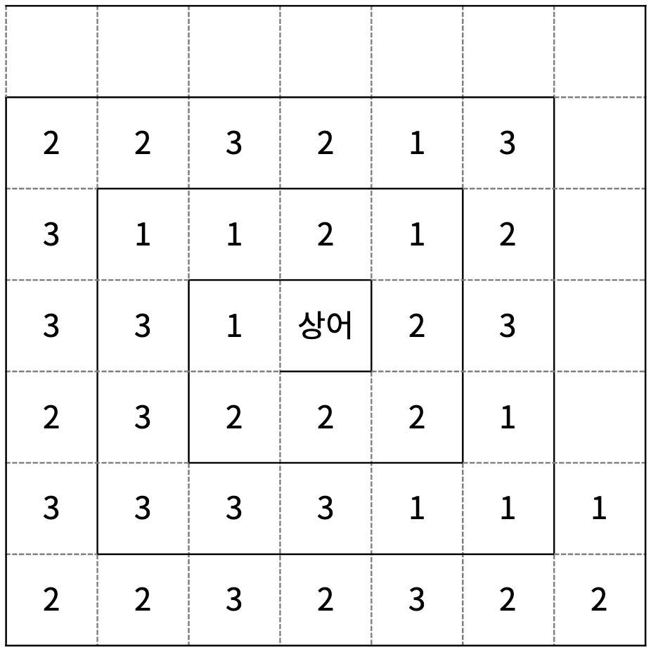

이제 구슬이 폭발하는 단계이다. 폭발하는 구슬은 4개 이상 연속하는 구슬이 있을 때 발생한다. 다음은 왼쪽 그림은 위의 상태에서 폭발하는 구슬이 들어있는 칸을 파란색과 초록색으로 표시한 것이고, 오른쪽 그림은 구슬이 폭발한 후의 상태이다.

| 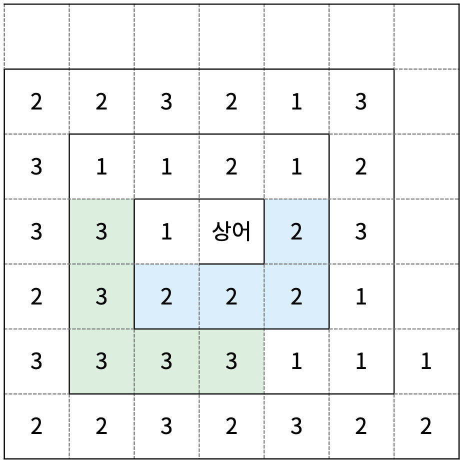 | 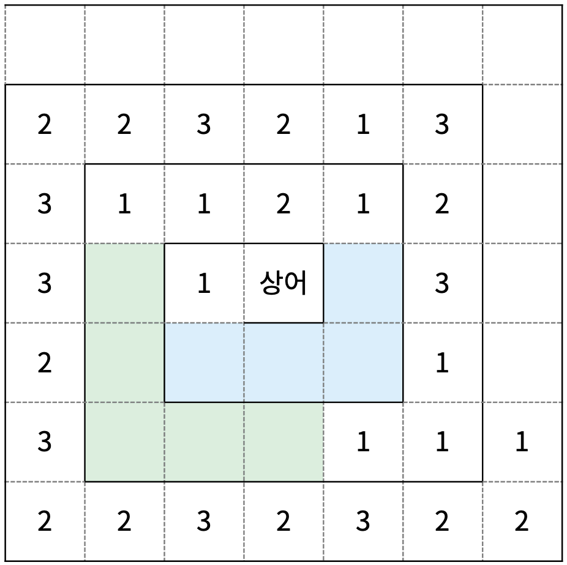 |
| ------------------------------------------------------------ | ------------------------------------------------------------ |
| 구슬이 폭발하기 전                                           | 구슬이 폭발한 후                                             |

구슬이 폭발해 빈 칸이 생겼으니 다시 구슬이 이동한다. 구슬이 이동한 후에는 다시 구슬이 폭발하는 단계이고, 이 과정은 더 이상 폭발하는 구슬이 없을때까지 반복된다. 구슬이 폭발한 후의 상태에서 구슬이 이동하면 다음과 같다.

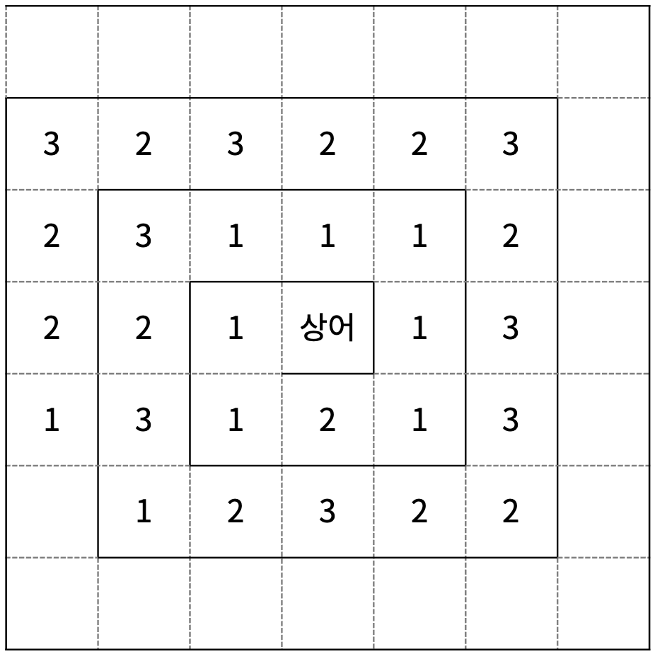

위의 상태는 4개 이상 연속하는 구슬이 있기 때문에 구슬이 다시 폭발하게 된다.

| 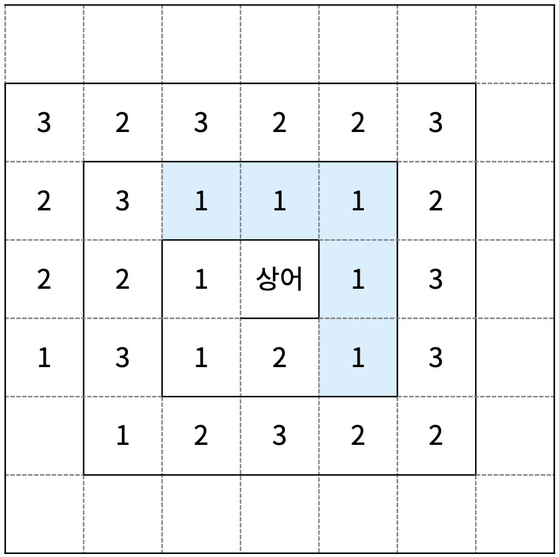 | 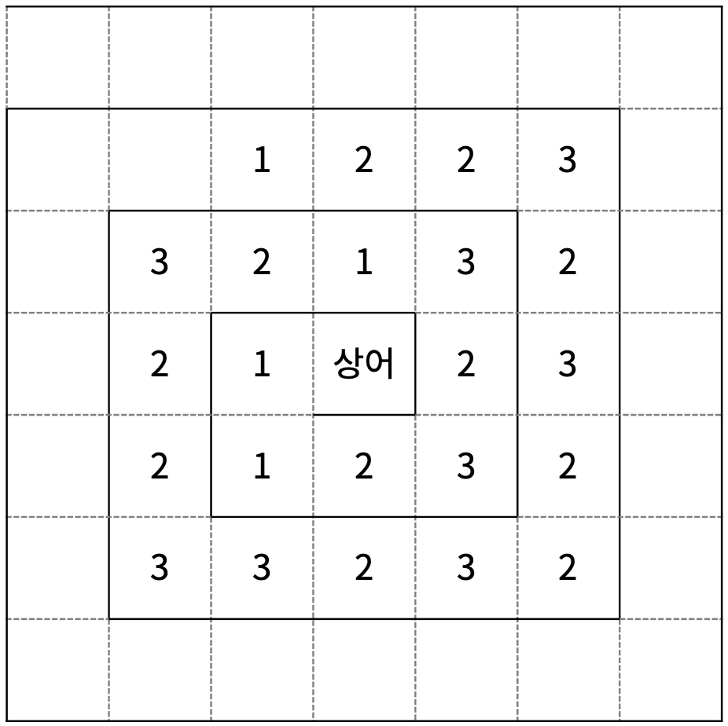 |
| ------------------------------------------------------------ | ------------------------------------------------------------ |
| 구슬이 폭발하기 전                                           | 구슬이 폭발하고 이동한 후                                    |

이제 더 이상 폭발한 구슬이 없기 때문에, 구슬이 변화하는 단계가 된다. 연속하는 구슬은 하나의 그룹이라고 한다. 다음은 1번 구슬은 빨간색, 2번 구슬은 파란색, 3번 구슬은 보라색으로 표시한 그림이다.

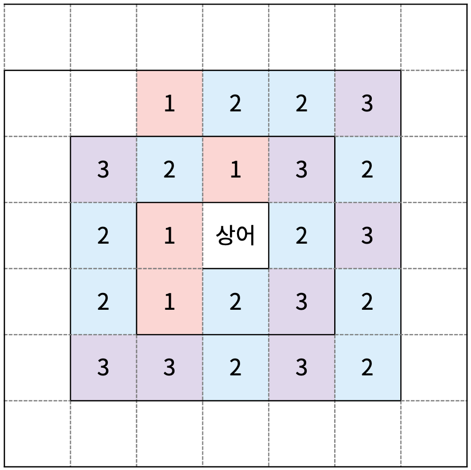

하나의 그룹은 두 개의 구슬 A와 B로 변한다. 구슬 A의 번호는 그룹에 들어있는 구슬의 개수이고, B는 그룹을 이루고 있는 구슬의 번호이다. 구슬은 다시 그룹의 순서대로 1번 칸부터 차례대로 A, B의 순서로 칸에 들어간다. 다음 그림은 구슬이 변화한 후이고, 색은 구분하기 위해 위의 그림에 있는 그룹의 색을 그대로 사용했다. 만약, 구슬이 칸의 수보다 많아 칸에 들어가지 못하는 경우 그러한 구슬은 사라진다.

 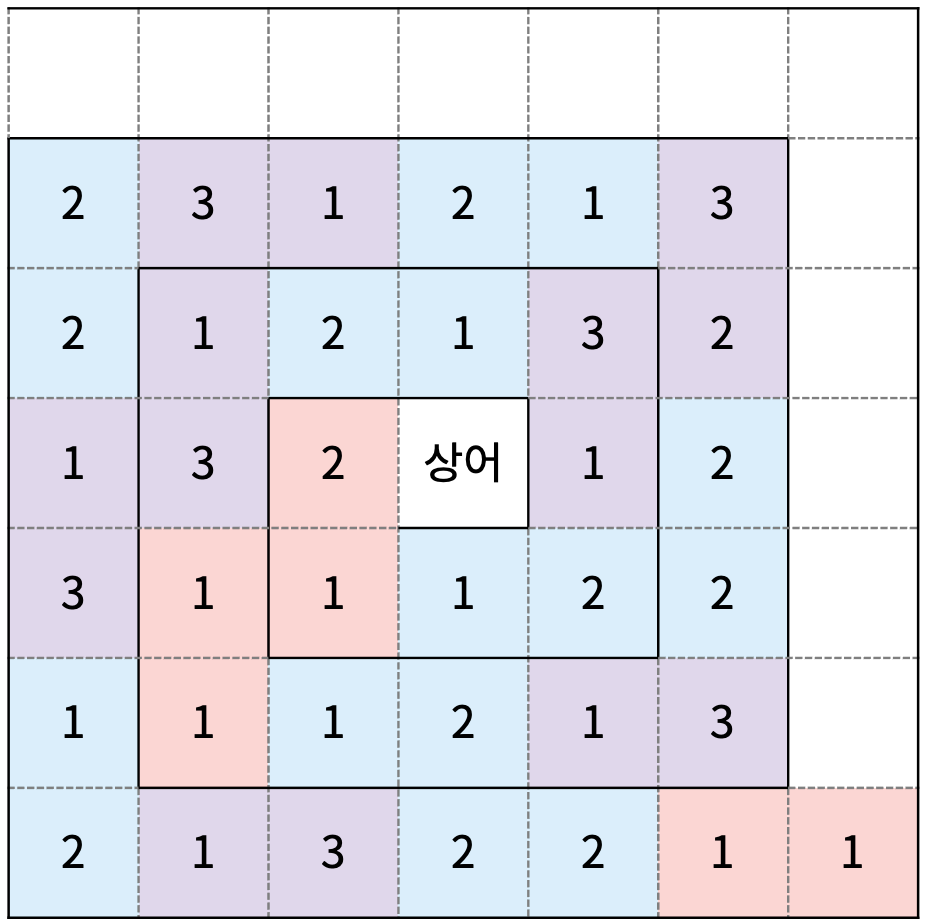

마법사 상어는 블리자드를 총 M번 시전했다. 시전한 마법의 정보가 주어졌을 때, 1×(폭발한 1번 구슬의 개수) + 2×(폭발한 2번 구슬의 개수) + 3×(폭발한 3번 구슬의 개수)를 구해보자.


### 입력

첫째 줄에 N, M이 주어진다. 둘째 줄부터 N개의 줄에는 격자에 들어있는 구슬의 정보가 주어진다. r번째 행의 c번째 정수는 (r, c)에 들어있는 구슬의 번호를 의미한다. 어떤 칸에 구슬이 없으면 0이 주어진다. 상어가 있는 칸도 항상 0이 주어진다.

다음 M개의 줄에는 블리자드 마법의 방향 di와 거리 si가 한 줄에 하나씩 마법을 시전한 순서대로 주어진다.

### 출력

첫째 줄에 1×(폭발한 1번 구슬의 개수) + 2×(폭발한 2번 구슬의 개수) + 3×(폭발한 3번 구슬의 개수)를 출력한다.

### 제한

- 3 ≤ N ≤ 49
- N은 홀수
- 1 ≤ M ≤ 100
- 1 ≤ di ≤ 4
- 1 ≤ si ≤ (N-1)/2
- 칸에 들어있는 구슬이 K개라면, 구슬이 들어있는 칸의 번호는 1번부터 K번까지이다.
- 입력으로 주어진 격자에는 4개 이상 연속하는 구슬이 없다.


## 예제

### 입력 1

```
7 1
0 0 0 0 0 0 0
3 2 1 3 2 3 0
2 1 2 1 2 1 0
2 1 1 0 2 1 1
3 3 2 3 2 1 2
3 3 3 1 3 3 2
2 3 2 2 3 2 3
2 2
```

### 출력 1

```
28
```


### 입력 2

```
7 4
0 0 0 2 3 2 3
1 2 3 1 2 3 1
2 3 1 2 3 1 2
1 2 3 0 2 3 1
2 3 1 2 3 1 2
3 1 2 3 1 2 3
1 2 3 1 2 3 1
1 3
2 2
3 1
4 3
```

### 출력 2

```
0
```

|  |  |
| ------------------------------------------------------------ | ------------------------------------------------------------ |
| 첫 번째 블리자드 후                                          | 두 번째 블리자드 후                                          |
|  |  |
| 세 번째 블리자드 후                                          | 네 번째 블리자드 후                                          |


### 입력 3

```
7 4
1 1 1 2 2 2 3
1 2 2 1 2 2 3
1 3 3 2 3 1 2
1 2 2 0 3 2 2
3 1 2 2 3 2 2
3 1 2 1 1 2 1
3 1 2 2 2 1 1
1 3
2 2
3 1
4 3
```

### 출력 3

```
39
```

|  |  |
| ------------------------------------------------------------ | ------------------------------------------------------------ |
| 첫 번째 블리자드 후                                          | 두 번째 블리자드 후                                          |
|  |  |
| 세 번째 블리자드 후                                          | 네 번째 블리자드 후                                          |


### 입력 4

```
7 7
1 1 1 2 2 2 3
1 2 2 1 2 2 3
1 3 3 2 3 1 2
1 2 2 0 3 2 2
3 1 2 2 3 2 2
3 1 2 1 1 2 1
3 1 2 2 2 1 1
1 3
2 2
3 1
4 3
1 3
1 1
1 3
```

### 출력 4

```
62
```


## 코드

```python
from collections import deque
import sys


def blizzard(r, c, d, s, field):
    dr, dc = MD[d]
    while s:
        r, c = r + dr, c + dc
        field[r][c] = 0  # 구슬 파괴
        s -= 1
    return field, True


def find_blanks(r, c, field):
    d = 0  # 순회 방향 (BD에 따라 순회)
    s = 1  # 이동 거리 (순회 방향이 홀수번째가 될 때마다 +1)
    flat_field = []
    # 순회하면서 1차원으로 변환, 빈 칸은 제외
    while r >= 0 and c >= 0:
        now_s = s
        while now_s:  # 거리만큼
            now_s -= 1
            now_ball = field[r][c]
            # 복사
            if now_ball:  # 구슬이 있는 경우만
                flat_field.append(now_ball)
            # 다음 좌표
            r += BD[d][0]
            c += BD[d][1]
        # 방향, 거리 업데이트
        d = (d + 1) % 4
        if d % 2:  # 홀수번 째 = 거리 추가
            s += 1
    return flat_field


def explode(bomb, ff):
    now = 0  # 현재 위치
    exist = False  # 빈칸 여부
    while now < len(ff):
        now_ball = ff[now]
        cnt = 1  # 연속 수
        for i in range(1, len(ff) - now + 1):
            if now + i >= len(ff) or now_ball != ff[now + i]:  # 조건 만족 x
                now += i
                break
            else:  # 같은 구슬이 연속됨
                cnt += 1
                continue
        if cnt >= 4:  # 4개가 연속 됨
            ff = ff[:now-cnt] + ff[now:]
            bomb[now_ball] += cnt
            exist = True  # 폭발이 있었으면 빈칸이 생김
            now -= cnt
    return ff, exist, bomb


def change_balls(ff):
    now = 0  # 현재 위치
    new_ff = []
    while now < len(ff):
        cnt = 0  # 연속 수
        # 연속된 수 탐색
        for next in range(now, len(ff)):
            if ff[now] == ff[next]:
                cnt += 1
            else:
                next -= 1
                break
        # 삽입
        new_ff.append(cnt)
        new_ff.append(ff[now])
        # 다음 위치
        now = next + 1
    return new_ff


def insert_balls(r, c, size, ff):
    d = 0  # 순회 방향 (BD에 따라 순회)
    s = 1  # 이동 거리 (순회 방향이 홀수번째가 될 때마다 +1)
    # 순회하면서 다시 자리에 넣기
    new_field = [[0] * size for _ in range(size)]
    while ff and r >= 0 and c >= 0:
        now_s = s
        while ff and now_s and r >= 0 and c >= 0:  # 거리만큼
            now_s -= 1
            # 새 구슬 넣기
            now_ball = ff.pop(0)
            new_field[r][c] = now_ball
            # 다음 좌표
            r += BD[d][0]
            c += BD[d][1]
        # 방향, 거리 업데이트
        d = (d + 1) % 4
        if d % 2:  # 홀수번 째 = 거리 추가
            s += 1
    return new_field


size, magic = map(int, sys.stdin.readline().split())  # 맵 크기, 마법 횟수
field = [[] for _ in range(size)]  # 맵 정보
for i in range(size):
    field[i] = list(map(int, sys.stdin.readline().split()))
magic_lst = [[] for _ in range(magic)]  # 마법 정보
for i in range(magic):
    magic_lst[i] = list(map(int, input().split()))

MD = [(), (-1, 0), (1, 0), (0, -1), (0, 1)]  # 마법 방향 (북남서동)
BD = [(1, 0), (0, 1), (-1, 0), (0, -1)]  # 구슬 순회 방향 (남동북서)
ex_balls = [0] * 4  # 폭발한 구슬 리스트
for d, s in magic_lst:  # d(방향=(1(북), 2(남), 3(서), 4(동)), s(거리)
    now_r, now_c = size // 2, size // 2  # 초기 위치

    # 1. 블리자드 마법 사용
    field, isBlank = blizzard(now_r, now_c, d, s, field)

    # 2. 구슬 정보를 1차원으로 변환
    flat_field = find_blanks(now_r, now_c - 1, field)

    # 3. 구슬 폭발 + 이동
    while isBlank:
        flat_field, isBlank, ex_balls = explode(ex_balls, flat_field)

    # 4. 구슬 변환
    flat_field = change_balls(flat_field)

    # 5. 순회하면서 다시 자리에 넣기
    field = insert_balls(now_r, now_c - 1, size, flat_field)

ans = ex_balls[1] + ex_balls[2] * 2 + ex_balls[3] * 3
print(ans)
```
