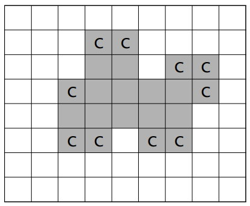
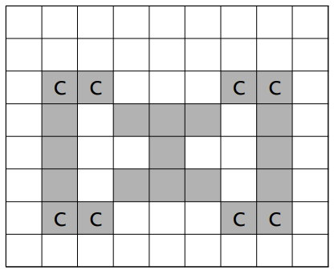
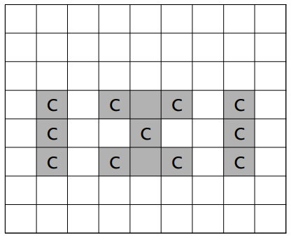

#  2638. 치즈

## 문제

N×M의 모눈종이 위에 아주 얇은 치즈가 <그림 1>과 같이 표시되어 있다. 단, N 은 세로 격자의 수이고, M 은 가로 격자의 수이다. 이 치즈는 냉동 보관을 해야만 하는데 실내온도에 내어놓으면 공기와 접촉하여 천천히 녹는다. 그런데 이러한 모눈종이 모양의 치즈에서 각 치즈 격자(작 은 정사각형 모양)의 4변 중에서 적어도 2변 이상이 실내온도의 공기와 접촉한 것은 정확히 한시간만에 녹아 없어져 버린다. 따라서 아래 <그림 1> 모양과 같은 치즈(회색으로 표시된 부분)라면 C로 표시된 모든 치즈 격자는 한 시간 후에 사라진다.



<그림 1>

<그림 2>와 같이 치즈 내부에 있는 공간은 치즈 외부 공기와 접촉하지 않는 것으로 가정한다. 그러므 로 이 공간에 접촉한 치즈 격자는 녹지 않고 C로 표시된 치즈 격자만 사라진다. 그러나 한 시간 후, 이 공간으로 외부공기가 유입되면 <그림 3>에서와 같이 C로 표시된 치즈 격자들이 사라지게 된다.



<그림 2>



<그림 3>

모눈종이의 맨 가장자리에는 치즈가 놓이지 않는 것으로 가정한다. 입력으로 주어진 치즈가 모두 녹아 없어지는데 걸리는 정확한 시간을 구하는 프로그램을 작성하시오.


### 입력

첫째 줄에는 모눈종이의 크기를 나타내는 두 개의 정수 N, M (5 ≤ N, M ≤ 100)이 주어진다. 그 다음 N개의 줄에는 모눈종이 위의 격자에 치즈가 있는 부분은 1로 표시되고, 치즈가 없는 부분은 0으로 표시된다. 또한, 각 0과 1은 하나의 공백으로 분리되어 있다.

### 출력

출력으로는 주어진 치즈가 모두 녹아 없어지는데 걸리는 정확한 시간을 정수로 첫 줄에 출력한다.


## 예제

### 입력 1

```python
8 9
0 0 0 0 0 0 0 0 0
0 0 0 1 1 0 0 0 0
0 0 0 1 1 0 1 1 0
0 0 1 1 1 1 1 1 0
0 0 1 1 1 1 1 0 0
0 0 1 1 0 1 1 0 0
0 0 0 0 0 0 0 0 0
0 0 0 0 0 0 0 0 0
```

### 출력 1

```python
4
```


## 코드

```python
from collections import deque
import sys


def bfs(lst, rowNum, colNum):
    queue = deque()
    queue.append((0, 0))
    visited = [[0] * colNum for _ in range(rowNum)]  # 빈 영역 방문 정보
    visited[0][0] = 1
    while queue:
        now_r, now_c = queue.popleft()
        for dr, dc in [(-1, 0), (0, -1), (1, 0), (0, 1)]:  # 북서남동
            new_r = now_r + dr
            new_c = now_c + dc
            if new_r < 0 or new_r >= rowNum or new_c < 0 or new_c >= colNum:
                continue  # 맵 바깥
            if visited[new_r][new_c]:
                continue  # 이미 탐색함
            if field[new_r][new_c] >= 1:  # 치즈가 얼마나 공기와 닿았는지
                lst[new_r][new_c] += 1
            else:  # 빈 영역
                visited[new_r][new_c] = 1
                queue.append((new_r, new_c))
    return


row, col = map(int, sys.stdin.readline().split())  # 모눈 종이의 세로, 가로 크기
field = [[] for _ in range(row)]  # 모눈 종이 정보
for i in range(row):
    field[i] = list(map(int, sys.stdin.readline().split()))
ans = 0

"""
[New]
1. (0, 0)부터 시작하면 내부에 격리된 공기와 만나기 전에 치즈와 먼저 만나게 됨
2. 따라서, (0, 0) 부터 방문 정보를 기록하면서 방문한 공기(두 영역 이상)와 치즈가 만날 때 녹는다고 판별
3. 공기를 만나면 방문을 기록, 치즈를 만나면 공기와 만난 횟수를 기록(카운트)
4. 치즈와 만났을 때 queue에 넣지 않으면 그 안쪽의 공기를 기록할 일은 없음
"""

flag = 1
while flag:
    flag = 0
    bfs(field, row, col)
    for r in range(1, row - 1):
        for c in range(1, col - 1):
            if field[r][c] >= 3:  # 두 영역 이상 공기와 닿은 치즈
                field[r][c] = 0  # 녹음
                flag = 1
            elif field[r][c] == 2:  # 한 영역과만 닿은 치즈
                field[r][c] = 1  # 녹지 않음
    if flag:
        ans += 1

print(ans)
```
